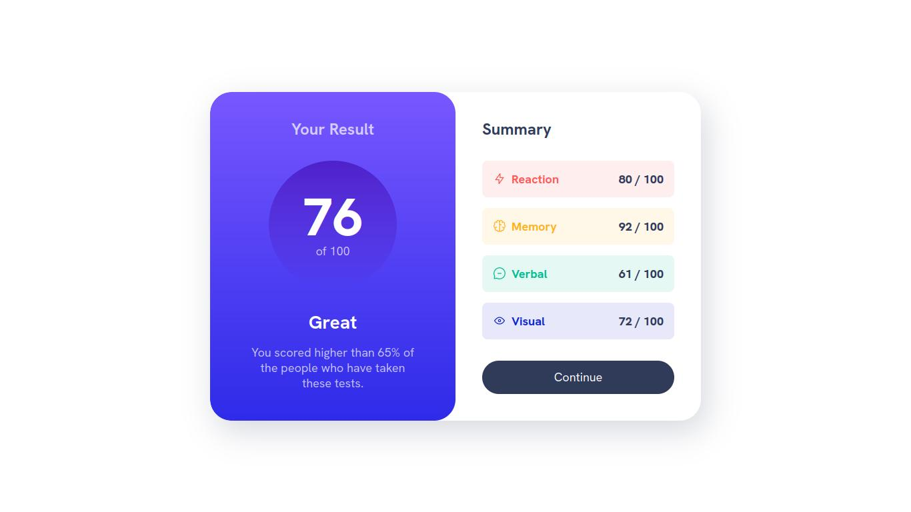

# Frontend Mentor - Results summary component solution

This is a solution to the [Results summary component challenge on Frontend Mentor](https://www.frontendmentor.io/challenges/results-summary-component-CE_K6s0maV). Frontend Mentor challenges help you improve your coding skills by building realistic projects. 

## Table of contents

- [Overview](#overview)
  - [The challenge](#the-challenge)
  - [Screenshot](#screenshot)
  - [Links](#links)
- [My process](#my-process)
  - [Built with](#built-with)
  - [What I learned](#what-i-learned)
  - [Useful resources](#useful-resources)
- [Author](#author)

## Overview

### The challenge

Users should be able to:

- View the optimal layout for the interface depending on their device's screen size
- See hover and focus states for all interactive elements on the page

### Screenshot

### Links

- Solution URL: [Github Solution](https://github.com/PedroReves/Result-Summary)
- Live Site URL: [Live Site](https://pedroreves.github.io/Result-Summary/)

## My process

### Built with

- Semantic HTML5 markup
- CSS custom properties
- Flexbox
- CSS Grid

### What I learned

I learned with Kevin Powell, most of the css techniques, we used grid a lot more than flexbox, we used custom properties to fix certain issues in our code, and some semantic HTML.

### Useful resources

- [Kevin Powell Video](https://www.youtube.com/watch?v=KqFAs5d3Yl8) - Here's the video that i used to build the project, he explains very well and he has a lot more other videos explaining css, html, and other things

## Author

- Frontend Mentor - [@PedroReves](https://www.frontendmentor.io/profile/PedroReves)

